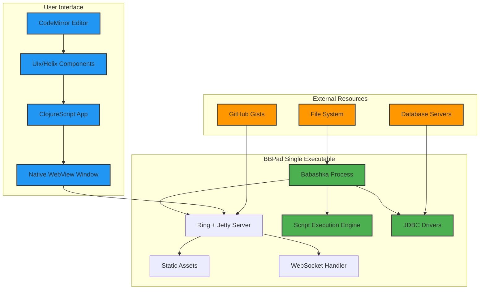
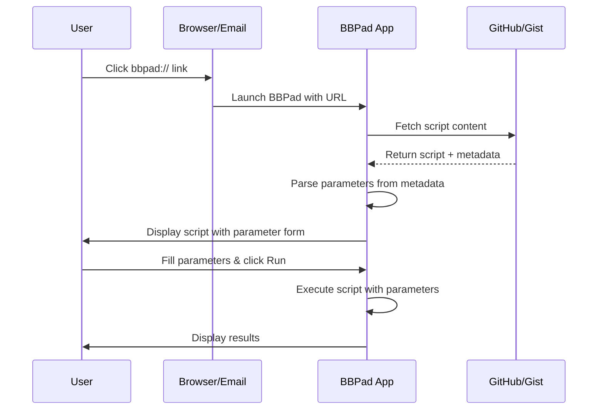
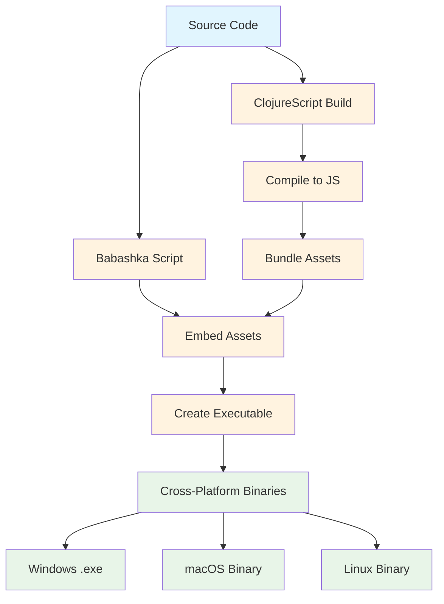
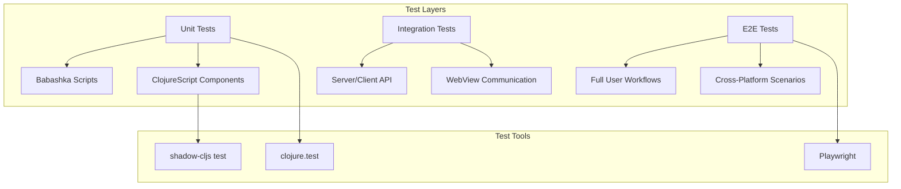

# BBPad 🚀

> A LINQPad-inspired desktop application for Babashka scripts

BBPad makes it easy to share and execute Babashka scripts with non-technical users. Built with pure Clojure/ClojureScript and packaged as a single executable for cross-platform distribution.

## ✨ Features

- **Zero Installation**: Single executable, no dependencies
- **Script Sharing**: Share scripts via URLs that open directly in BBPad
- **Rich Output**: Syntax-highlighted results, tables, charts, and images
- **Database Support**: Connect to PostgreSQL, MySQL, SQLite, and more via JDBC
- **Native Feel**: Dedicated desktop window using WebView technology
- **Cross-Platform**: Windows, macOS, and Linux support

## 🏗️ Architecture

BBPad uses a unique architecture combining Babashka's power with modern web UI technology:



## 🚀 Quick Start

### Download and Run
1. Download the latest release for your platform from [Releases](https://github.com/kbosompem/bbpad/releases)
2. Double-click the executable to launch BBPad
3. Start writing and executing Babashka scripts immediately!

### Example Script
```clojure
;; Simple data processing example
(require '[clojure.string :as str])

(defn process-data [text]
  (->> text
       str/split-lines
       (map str/trim)
       (remove str/blank?)
       (map str/upper-case)
       (into [])))

(process-data "hello\nworld\n\nbbpad")
;; => ["HELLO" "WORLD" "BBPAD"]
```

## 🔗 Script Sharing

Share scripts with colleagues using URLs:

```
bbpad://load?script=https://gist.github.com/username/script-id
```

### URL Protocol Flow



## 🧪 Development

### Prerequisites
- [Babashka](https://github.com/babashka/babashka) >= 1.0.0
- [Node.js](https://nodejs.org/) >= 18 (for ClojureScript build)
- [Git](https://git-scm.com/)

### Local Development
```bash
# Clone the repository
git clone https://github.com/kbosompem/bbpad.git
cd bbpad

# Install dependencies and start development server
bb dev

# In another terminal, build ClojureScript
npm install
npm run build:dev

# Run tests
bb test
npm run test
```

### Build Process



## 🧪 Testing

BBPad uses comprehensive testing at all levels:

```bash
# Unit tests for Clojure/ClojureScript code
bb test:unit

# Integration tests for server/client communication
bb test:integration  

# End-to-end tests using playwright
npm run test:e2e

# All tests
bb test:all
```

### Test Architecture



## 📦 Releases

BBPad follows semantic versioning and provides automated releases:

- **Stable releases** from `main` branch
- **Pre-releases** from `develop` branch  
- **Automated builds** via GitHub Actions
- **Cross-platform binaries** for Windows, macOS, and Linux

## 🤝 Contributing

We welcome contributions! Please see [CONTRIBUTING.md](CONTRIBUTING.md) for guidelines.

### Development Workflow

```mermaid
gitgraph
    commit id: "Initial"
    branch develop
    checkout develop
    commit id: "Feature A"
    commit id: "Feature B"
    checkout main
    merge develop
    commit id: "Release v1.0"
    branch hotfix
    checkout hotfix
    commit id: "Bug fix"
    checkout main
    merge hotfix
    commit id: "Release v1.0.1"
```

## 📄 License

MIT License - see [LICENSE](LICENSE) file for details.

## 🙏 Acknowledgments

- [Babashka](https://github.com/babashka/babashka) - The amazing Clojure scripting runtime
- [LINQPad](https://www.linqpad.net/) - Inspiration for the user experience
- [UIx](https://github.com/pitch-io/uix) - React bindings for ClojureScript
- The Clojure community for continuous inspiration

---

Made with ❤️ and Clojure