# BBPad Architecture

This document provides a comprehensive overview of BBPad's technical architecture, design decisions, and implementation details.

## 🎯 Design Goals

- **Single Executable**: No installation or dependencies required
- **Native Performance**: Fast startup and script execution
- **Cross-Platform**: Identical experience on Windows, macOS, and Linux
- **Developer Friendly**: Pure Clojure/ClojureScript stack
- **User Friendly**: Web-based UI with native desktop integration

## 🏗️ High-Level Architecture

BBPad combines several technologies to create a unique desktop application experience:

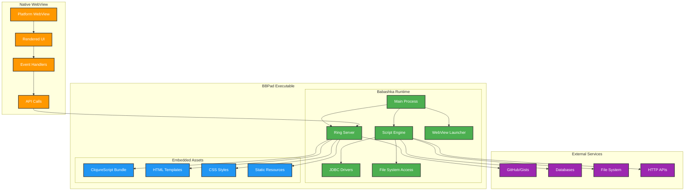

## 🔧 Component Details

### 1. Babashka Runtime Layer

The core of BBPad runs entirely in Babashka, providing:

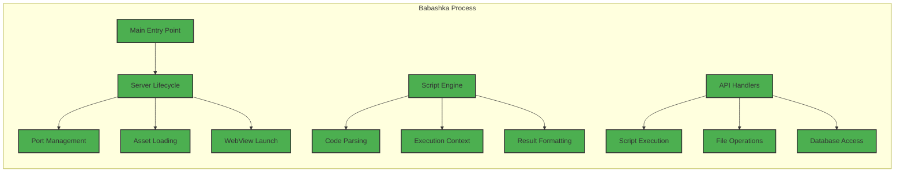

**Key Responsibilities:**
- HTTP server management (Ring + Jetty)
- Script execution and sandboxing
- WebView process management
- Asset serving and caching
- Database connection pooling

### 2. Web Server (Ring + Jetty)

The embedded web server provides the API and UI serving:

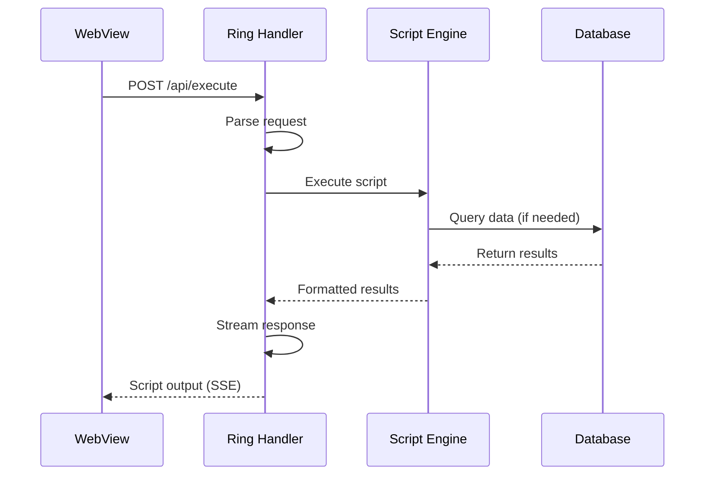

**API Endpoints:**
- `GET /` - Serve main UI
- `POST /api/execute` - Execute Babashka script
- `GET /api/script/load` - Load script from URL
- `POST /api/script/save` - Save script locally
- `GET /api/connections` - Database connections
- `GET /events` - Server-Sent Events for real-time updates

### 3. Frontend Architecture (ClojureScript + UIx)

The UI is built with modern ClojureScript tooling:

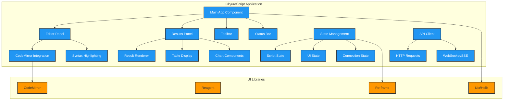

### 4. WebView Integration

Platform-specific WebView handling:

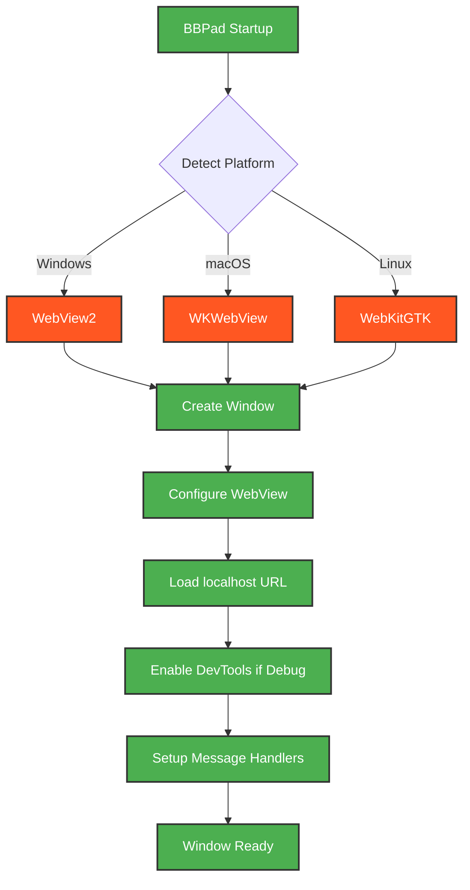

**WebView Requirements:**
- **Windows**: WebView2 runtime (bundled or system-installed)
- **macOS**: WKWebView (built into macOS)
- **Linux**: WebKitGTK (commonly available)

## 🚀 Startup Sequence

The application follows a carefully orchestrated startup process:

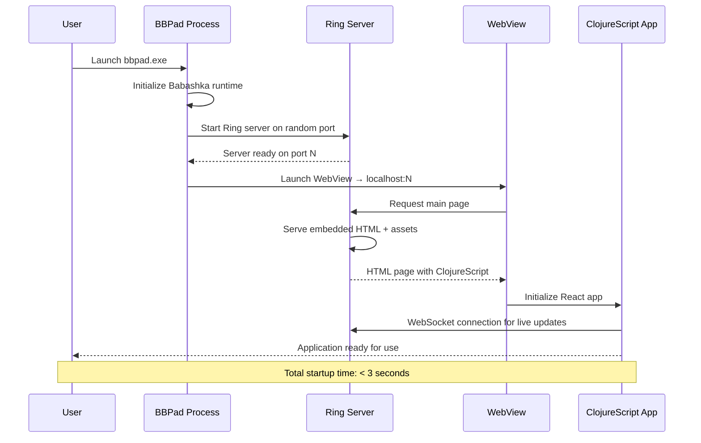

## 🔒 Security Model

BBPad implements multiple layers of security:

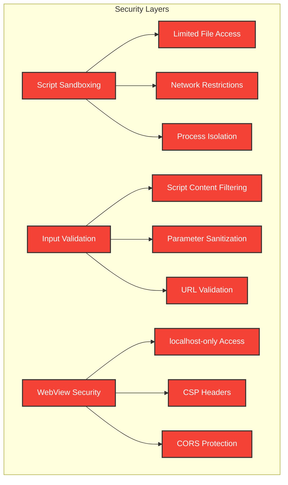

**Security Principles:**
- Scripts run in Babashka's natural sandbox
- File system access limited to user-designated directories  
- Network access explicit and controllable
- WebView confined to localhost communication
- Input validation at all API boundaries

## 📊 Data Flow

Understanding how data flows through the system:

```mermaid
flowchart TD
    subgraph "User Actions"
        A[Write Script] --> B[Click Run]
        C[Load from URL] --> D[Fill Parameters]
        E[Save Script] --> F[Share URL]
    end
    
    subgraph "Processing Pipeline"
        B --> G[Parse Script]
        G --> H[Validate Syntax]
        H --> I[Execute in Babashka]
        I --> J[Format Results]
        J --> K[Stream to UI]
        
        D --> L[Inject Parameters]
        L --> G
        
        C --> M[Fetch Remote Script]
        M --> N[Parse Metadata]
        N --> O[Generate Parameter Form]
    end
    
    subgraph "Result Display"
        K --> P{Result Type?}
        P -->|Text| Q[Text Display]
        P -->|Data| R[Table Renderer]
        P -->|Chart| S[Visualization]
        P -->|Error| T[Error Display]
    end
    
    classDef action fill:#4CAF50,stroke:#333,stroke-width:2px,color:#fff
    classDef process fill:#2196F3,stroke:#333,stroke-width:2px,color:#fff
    classDef display fill:#FF9800,stroke:#333,stroke-width:2px,color:#fff
    
    class A,B,C,D,E,F action
    class G,H,I,J,K,L,M,N,O process  
    class P,Q,R,S,T display
```

## 🔧 Build and Packaging

The build process creates a self-contained executable:

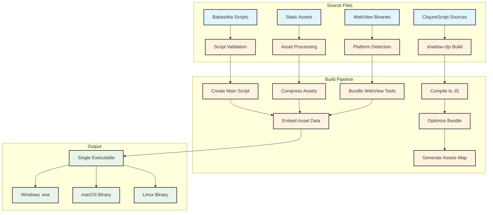

## 🧪 Testing Strategy

Comprehensive testing across all layers:

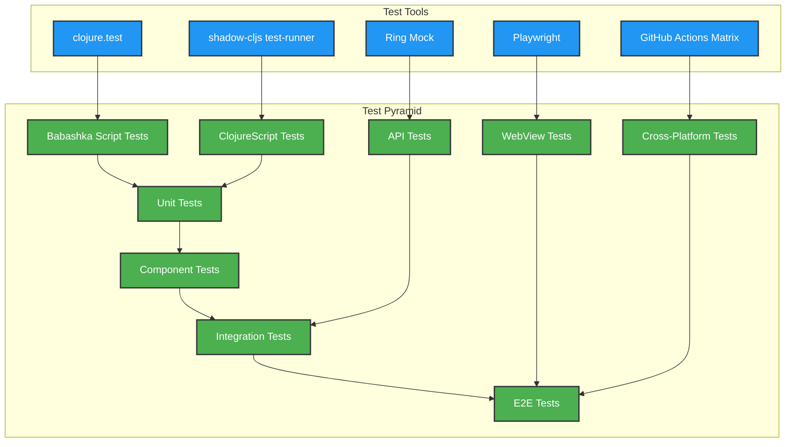

## ⚠️ Babashka Limitations & Solutions

### Library Constraints

Babashka has specific limitations that affect BBPad's architecture:

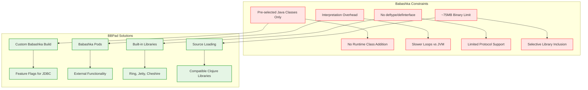

### Critical Libraries for BBPad

**Built-in Support Required:**
- ✅ Ring/Jetty (web server)
- ✅ Cheshire (JSON)  
- ✅ next.jdbc (database - via feature flag)
- ✅ Hiccup (HTML generation)
- ⚠️ ClojureScript compiler (may need pod)

**Pod-based Extensions:**
- Database drivers (PostgreSQL, MySQL via pods)
- Advanced visualization libraries
- File format processors (Excel, PDF)
- OAuth/authentication providers

### Custom Babashka Build Strategy

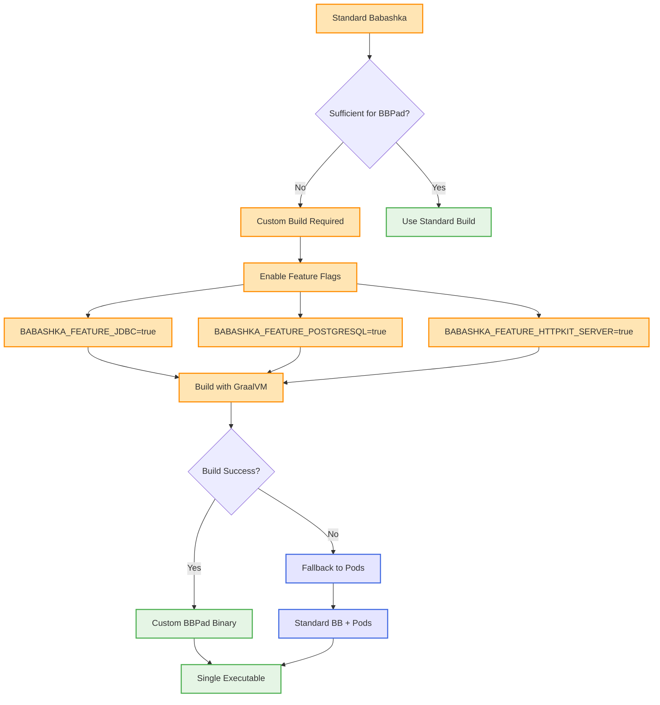

### Pod Integration Architecture

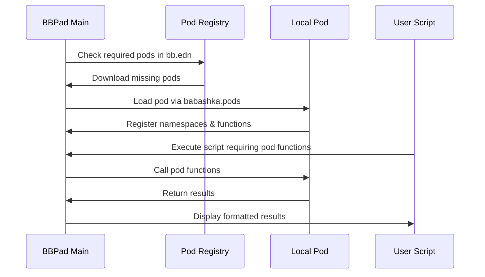

### Updated Build Configuration

**bb.edn with Pod Support:**
```clojure
{:paths ["src"]
 :pods {org.babashka/postgresql {:version "0.1.0"}
        org.babashka/hsqldb {:version "0.1.0"}
        epiccastle/bbssh {:version "0.5.0"}}
 :deps {; Standard deps remain the same}}
```

**Environment Variables for Custom Build:**
```bash
export BABASHKA_FEATURE_JDBC=true
export BABASHKA_FEATURE_POSTGRESQL=true  
export BABASHKA_FEATURE_HTTPKIT_SERVER=true
export GRAALVM_HOME="/path/to/graalvm-ce-21.0.1"
export NATIVE_IMAGE_DEPRECATED_BUILDER_SANITATION=true
```

## 🚀 Deployment and Distribution

Multi-platform release pipeline with Babashka considerations:

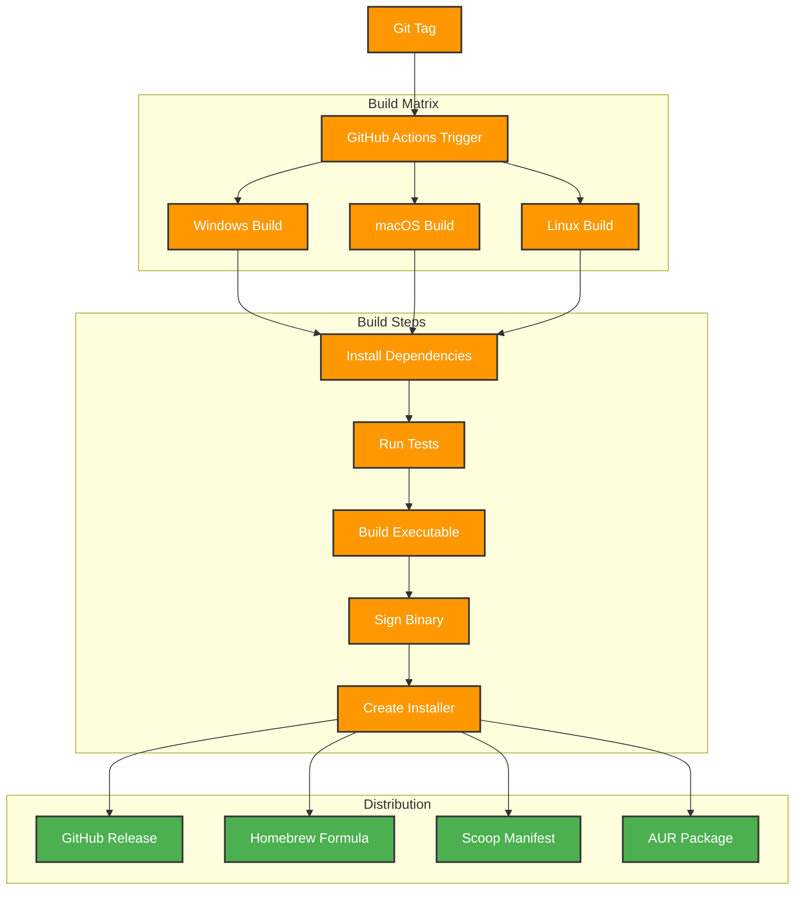

## 🔮 Future Architecture Considerations

Planned architectural evolution:

- **Plugin System**: Dynamic loading of Babashka libraries
- **Collaborative Features**: Real-time script sharing and editing
- **Cloud Integration**: Optional cloud storage and sync
- **Performance Monitoring**: Built-in script performance profiling
- **Advanced Security**: Script signing and verification system

---

This architecture provides a solid foundation for BBPad's current needs while maintaining flexibility for future enhancements.